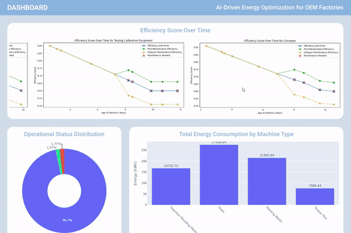

# AI-Driven Predictive Maintenance for OEMs - i.Mobilothon 4.0

Welcome to our GitHub repository for the i.Mobilothon 4.0 challenge, focusing on Artificial Intelligence and Machine Learning applications in the OEM industry. This project employs machine learning techniques with a RandomForestRegressor to predict machine efficiency and schedule predictive maintenance, showcased through an advanced analytics dashboard with a simulated dataset.

## Challenge Overview

Our submission aligns with the i.Mobilothon 4.0 challenge theme "Artificial Intelligence and Machine Learning for OEMs," enhancing predictive maintenance capabilities in the OEM sector using AI-driven analytics.

## Dataset Description

This project utilizes the `Volkswagen_OEM_AsiaPacific_2023_SyntheticDataset_withAge.csv`, a simulated dataset designed to mirror real-world scenarios for various types of industrial machinery:

- **Machine Types**: Includes Painting Booth, Oven, Torque Tool, etc.
- **Machine ID**: Unique identifier for each machine.
- **Buying Date**: Used to calculate the age of the machine.
- **Factory Location**: Operational environment of the machine.
- **Operational Status**: Current status of the machine.
- **Machine Age**: Time since purchase, important for maintenance predictions.
- **Efficiency Score**: Simulated historical efficiency data used to train the predictive model.

## Model and Dashboard

### Model
We use the `RandomForestRegressor`, known for its accuracy in regression tasks, to forecast future machine performance from the simulated historical data.

### Dashboard GIF
Below is a GIF demonstrating the functionality of our advanced analytics dashboard:

Our dashboard visualizes predictive results and real-time data, aiding operational decisions in the OEM environment.

## Repository Structure

- `data/`: Contains the simulated dataset.
- `notebooks/`: Jupyter notebook for model training and exploration, Source code for the predictive model.
- `dashboards/`: Script for the analytics dashboard.

## Contributions

Contributions to enhance this project are welcome. Please fork the repository, apply your changes, and submit a pull request.

## License

This project is licensed under the MIT License - see the [LICENSE](LICENSE) file for details.

## Contact

For any inquiries or feedback, please open an issue in this repository.

Thank you for visiting our i.Mobilothon 4.0 challenge submission.

